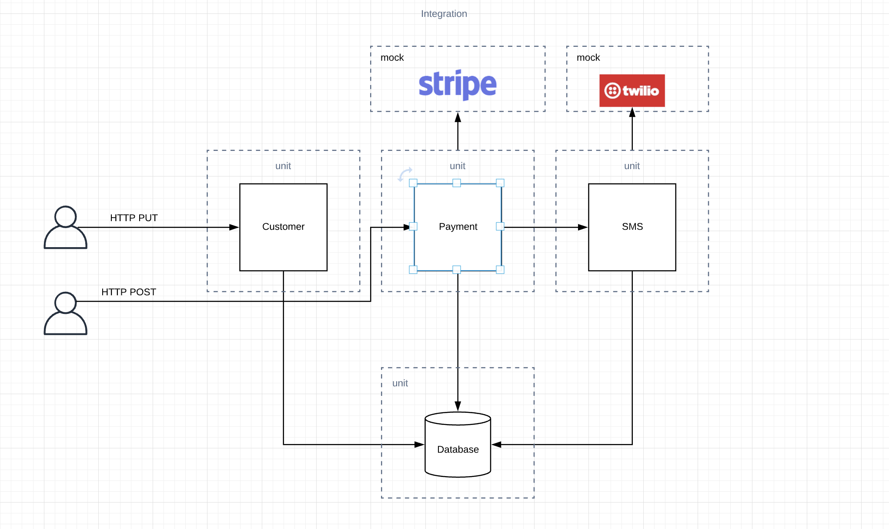

# software-testing
This is a test from a course (available on https://amigoscode.com/) to understand unit tests and integration tests with SpringBoot.

It follows the pattern MVC with different layers as showed in the following image.

# List of topics for this course
- Unit Testing
- Integration Testing
- Testing External Services
- Mocking with Mockito
- Test Driven Development

Every commit contains tests or different way to reach the same result.